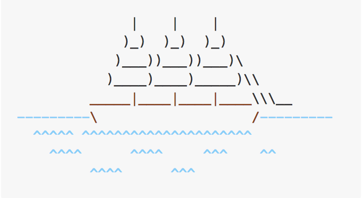

# Vim-rumrunner

A better MRU list.



## Overview

I have two problems with existing MRU (most recently used) implementations for vim. First, they're isolated, so while you can install, say, mru.vim, other plugins like BufExplorer can't use the list it maintains. Thus BufExplorer implements its own mru list. Which means multiple plugins you use are, potentially, doing the same work to keep the same list. What we need is an MRU plugin with a public-facing API for accessing and manipulating the most recently used list, so that it only needs to be implemented and maintained once and can be shared by all.

The second problem is that most MRU implementations don't provide a clean way to move around the list. That's because, once you go to the _second_ most recently used file, it _becomes_ the most recently used file, so repeating the action over and over will only toggle you between the two most recently used files instead of walking back through the entire list.

Vim-rumrunner attempts to solve both these problems: the first by providing methods to access the list it maintains and the second by temporarily suspending mru recordization when navigating up and down the mru tree.

## Requirements

This plugin uses timers, which means it requires at least vim 8.0. It also uses lambdas, so make sure `:echo has('lambda')` is 1.

## Installation

If you don't have a preferred installation method, I really like vim-plug and recommend it.

#### Manual

Clone this repository and copy the files in plugin/, autoload/, and doc/ to their respective directories in your vimfiles, or copy the text from the github repository into new files in those directories. Make sure to run `:helptag`.

#### Plug (https://github.com/junegunn/vim-plug)

Add the following to your vimrc, or something sourced therein:

```vim
Plug 'tandrewnichols/vim-rumrunner'
```

Then install via `:PlugInstall`

#### Vundle (https://github.com/gmarik/Vundle.vim)

Add the following to your vimrc, or something sourced therein:

```vim
Plugin 'tandrewnichols/vim-rumrunner'
```

Then install via `:BundleInstall`

#### NeoBundle (https://github.com/Shougo/neobundle.vim)

Add the following to your vimrc, or something sourced therein:

```vim
NeoBundle 'tandrewnichols/vim-rumrunner'
```

Then install via `:BundleInstall`

#### Pathogen (https://github.com/tpope/vim-pathogen)

```sh
git clone https://github.com/tandrewnichols/vim-rumrunner.git ~/.vim/bundle/vim-rumrunner
```

## Usage

#### Navigation

Rumrunner provides two functions to navigate the mru list, as well as commands and mappings to those functions.

- `rum#prev()` - Move down the most recently used list (to less recently used files). This is mapped by default to `[r` (for "rum" or "recent") and available via the `:RumPrev` command.
- `rum#next()` - Move up the most recently used list (to more recently used files). This is mapped by default to `]r` and available via the `:RumNext` command.

Both of these commands and mappings take counts to jump more than one file at a time and both call [rum#suspend()](rum-suspend), which makes Rumrunner stop changing the mru list, even as files are loaded. They then call [rum#resume()](rum-resume) in a timer (with a default timeout of 2 seconds). This timer is debounced so that, if you continue to navigate the tree, the timeout is reset, which means that you can navigate down the mru list 3 files by typing `[r` 3 times (unlike other mru implementations in which you would just bounce between the two newest files). I like a 2 second timeout because it gives me a moment to look at the file to see if it's the one I want and still move on if necessary before rum resumes, but you can configure that value via [g:rum.resume_timeout](rum-resume-timeout).

Example:

You have 5 files in your MRU list:

```
> a.txt
  b.txt
  c.txt
  d.txt
  e.txt
```

where `>` is your active buffer. You hit `[r` to move from `a.txt` to `b.txt`. Your MRU list now looks like this:

```
  a.txt
> b.txt
  c.txt
  d.txt
  e.txt
```

Notice how `b.txt` has not yet been moved to the most recently used position. That's because mru recordization is temporarily suspended. If you wait 2 seconds without doing more jumping, your list will look like this:

```
> b.txt
  a.txt
  c.txt
  d.txt
  e.txt
```

But you can also continue jumping backward (or forward). Let's say you jump backward again. Your MRU list now looks like this:

```
  a.txt
  b.txt
> c.txt
  d.txt
  e.txt
```

Press `[r` again and it looks like this:

```
  a.txt
  b.txt
  c.txt
> d.txt
  e.txt
```

But maybe that was too far and you did in fact want to edit `c.txt`. No problem. The MRU list hasn't synced yet, so just jump forward again with `]r`. Now you're back to:

```
  a.txt
  b.txt
> c.txt
  d.txt
  e.txt
```

Now after you wait 2 seconds, your list looks like this:

```
> c.txt
  a.txt
  b.txt
  d.txt
  e.txt
```

Notice that _only_ the one file you're editing changed places. The other files didn't move because you didn't actually "use" them (they are not "more recently used").

#### Ignoring files

It's possible that you won't ever want particular files to be in the most recently used list. You can ignore files by calling `rum#ignore()` with either a string pattern or a funcref/lambda. If you pass a function, it will be called with a single argument, the name of the file currently being added to the MRU list. Return 1 to indicate to Rumrunner that the file should _not_ be added to the list (1 meaning, "Yes, ignore this file"). By default, directories, unlisted buffers, help entries, and diffs are ignored, although this is configurable (see [options](options)).

#### Suspend and resume

If you're doing something that might create an unwanted entry in the mru list, you can, yourself, suspend Rumrunner by calling `rum#suspend()`, but note that you will need to later call `rum#resume()` to reenable Rumrunner, otherwise, files will never be added to the MRU list. Note also that `rum#resume()` checks whether the current buffer is first in the MRU list and puts it there if it's not, which means you shouldn't resume until you are in a buffer that you want to be included in the MRU list.

## Plugin Authors

If you're just a general user, the above is probably more than sufficient to make the most of Rumrunner. If you're writing a plugin that could benefit from an MRU list and you want to use Rumrunner, here's some other stuff you might want to know.

#### Add a file to the MRU list

Seems unlikely that you'd need to do this but if you do, just call `rum#add()` with the buffer number and buffer name.

#### Remove a file from the MRU list

Buffers are automically removed from the MRU list on `BufWipeout` and `BufDelete`, but it's possible you might want to remove a file from the MRU list yourself. Just call `rum#remove()` with the buffer number and buffer name.

#### Access the list

The main reason you might include Rumrunner as a dependency is to access it's MRU list (for whatever sordid purpose you might have). Just call `rum#get()` and a list of dictionariies will be returned. Each dictionary has two properties:

  - num - the buffer number
  - name - the buffer name

Note that the buffer name is in the form that `expand("<afile>")` returns, which is usually relative to the current working directory.

Example:

```vim
function! DoSomething()
  let list = rum#get()
  " Do something with `list`
endfunction
```

[Vim-rebuff](https://github.com/tandrewnichols/vim-rebuff) uses this list to sort it's own buffer list by most recently used buffer.

## Full API

#### Functions

- `rum#add(num, name)` - Add a new entry to the MRU list.
- `rum#remove(num, name)` - Remove an entry from the MRU list.
- `rum#suspend()` - Temporarily turn off MRU recordization.
- `rum#resume()` - Re-enable MRU recordization.
- `rum#get()` - Get the current MRU list.
- `rum#ignore(pattern)` - Add a pattern or function to the blacklist. The blacklist is used to determine whether a file should be added to the MRU list.
- `rum#isIgnored(file)` - Called internally to determine whether a file should be added to the list. This function iterates over the blacklist patterns and function and returns 1 for files being ignored and 0 for files to include.
- `rum#prev(count)` - Move `<count>` entries backward in the MRU list (to less recent files).
- `rum#next(count)` - Move `<count>` entries forward in the MRU list (to more recent files).
- `rum#move(count)` - Move `<count>` entries in the MRU list. If `<count>` is negative, it moves forward (which sounds counter-intuitive until you realize that it's adding `<count>` to the current index, which for a negative number means moving toward 0, or _the first_ entry). A positive number moves backward.

#### Commands

- `:<count>RumPrev` - Move `<count>` entries backward in the MRU list (to less recent files).
- `:<count>RumNext` - Move `<count>` entries forward in the MRU list (to more recent files).

#### Mappings

- `<count>[r` - Move `<count>` entries backward in the MRU list (to less recent files).
- `<count>]r` - Move `<count>` entries forward in the MRU list (to more recent files).

As a slight aside, add [vim-submode](https://github.com/kana/vim-submode) to make repeated navigation simpler.

#### Options

- g:rum.resume_timeout (Default: 2000)

  Timer duration in milliseconds when navigating the MRU list before resuming recordization.

- g:rum.disabled (Default: 0)

  Internal flag used by `rum#suspend()` and `rum#resume()` to determine whether to add files to the MRU list. The only reason you'd maybe want to set this to 1 is if you wanted Rumrunner to be disabled when vim starts up and then later enabled.

- g:rum.ignore_dirs (Default: 1)

  Don't add directories to the MRU list. Personally, I don't think of directories as things that are "used," as I'm typically just passing through them to find a particular file, thus they are not added to the MRU list by default.

- g:rum.rummignore_help (Default: 1)

  Don't add help entries to the MRU list.

- g:rum.ignore_unlisted (Default: 1)

  Don't add unlisted buffers to the MRU list. These are almost always temp buffers and wrappers provided by other plugins that you don't want to cycle through.

- g:rum.ignore_diffs (Default: 1)

  Don't add diffs, including fugitive buffers, to the MRU list.

- g:rum.blacklist (Default: [])

  The actual blacklist of patterns and functions used to determine whether a file is ignored. This is exposed publicly because calling `rum#ignore` has to be loaded so you'd have to call it in an `after/plugins` script. If you don't want to mess with that, you can just set the initial list to something else.

## Fun Facts

Rumrunner (and derivatives) is the only word in the English language with "mru" in it in order. Hence the name. You can imagine how excited I was when I found that out. But I also just like the imagery of a pirate doing work behind the scenes to make sure you've always got what you need.

## Contributing

I always try to be open to suggestions, but I do still have opinions about what this should and should not be so . . . it never hurts to ask before investing a lot of time on a patch.

## License

See [LICENSE](./LICENSE)
